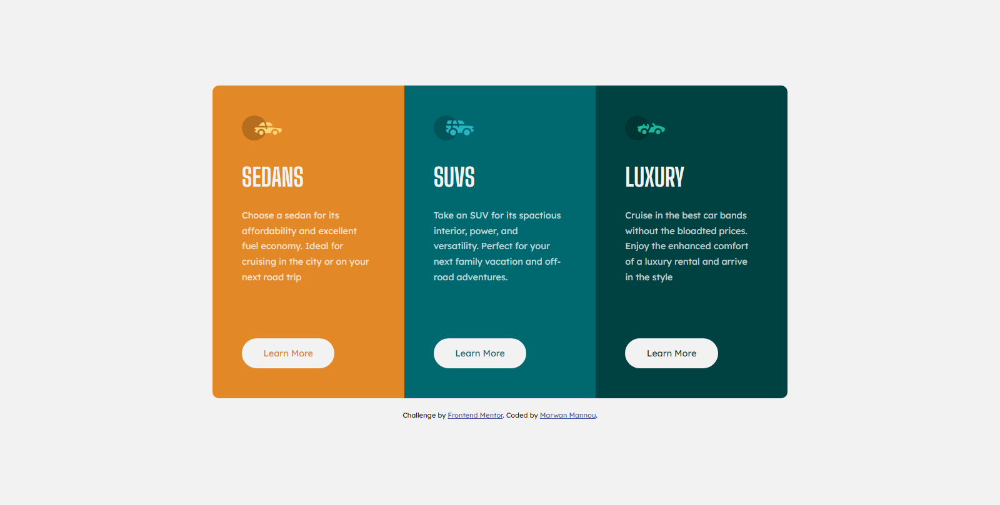

# Frontend Mentor - 3-column preview card component solution

This is a solution to the [3-column preview card component challenge on Frontend Mentor](https://www.frontendmentor.io/challenges/3column-preview-card-component-pH92eAR2-). Frontend Mentor challenges help you improve your coding skills by building realistic projects. 

## Table of contents

- [Overview](#overview)
  - [The challenge](#the-challenge)
  - [Screenshot](#screenshot)
  - [Links](#links)
- [My process](#my-process)
  - [Built with](#built-with)
  - [What I learned](#what-i-learned)


## Overview

### The challenge

Users should be able to:

- View the optimal layout depending on their device's screen size
- See hover states for interactive elements

### Screenshot



### Links

- Solution URL: https://www.frontendmentor.io/challenges3column-preview-card-component-pH92eAR2-
- Live Site URL: [Add live site URL here](https://your-live-site-url.com)

## My process

### Built with

- Semantic HTML5 markup
- CSS custom properties
- Flexbox

### What I learned

This is my second chellenge on frontendmentor.io, and with the experience gained from my mistakes in my first challenge,
I tried to avoid those mistakes and aproach the project in a different way.

1. Sematic tags: main/article/h1/p
2. white-space: nowrap;
3. Centering the element with grid:
```css
.body {
  display: grid;
  place-content: center;
}
